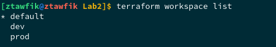
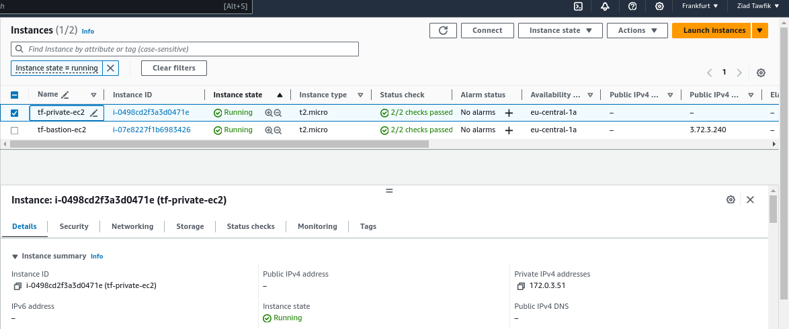
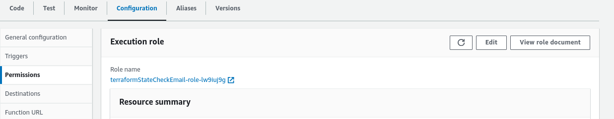
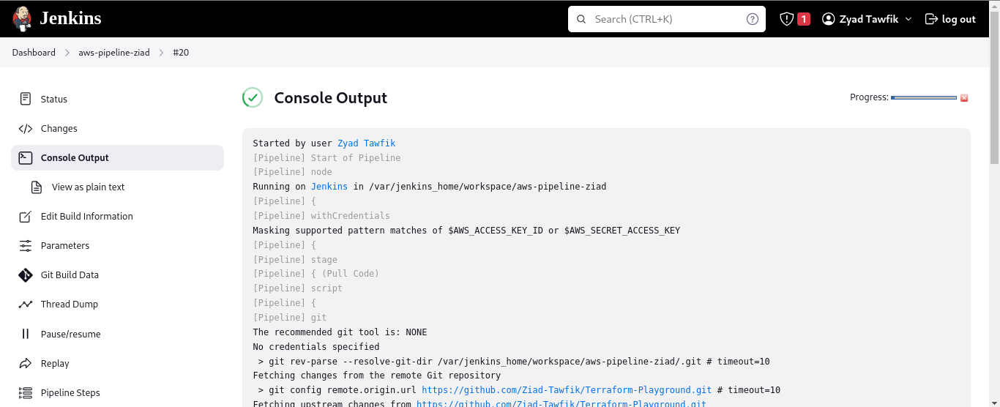
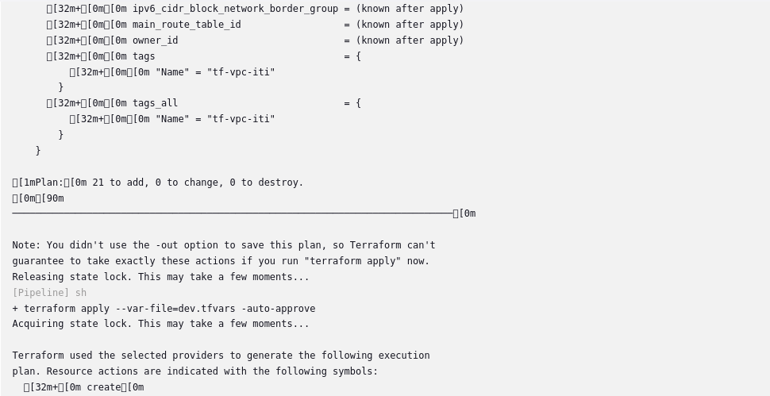
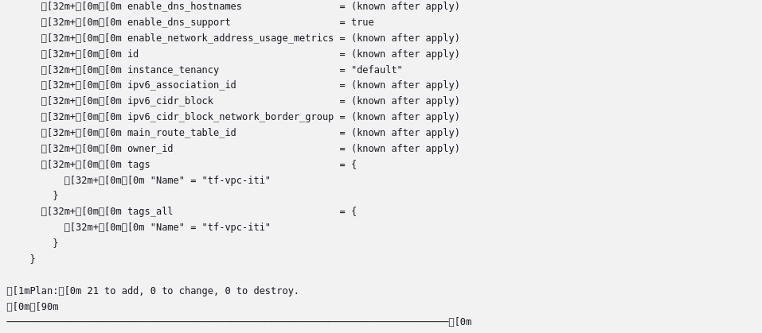

# Lab2 Screenshots

## Apply Terraform in Dev Workspace

## Apply Terraform in Prod Workspace

## Create Docker file with Jenkins and Terraform

## Run Docker container and configure Jenkins

## SES Service and Lambda

## Jenkins Pipeline

